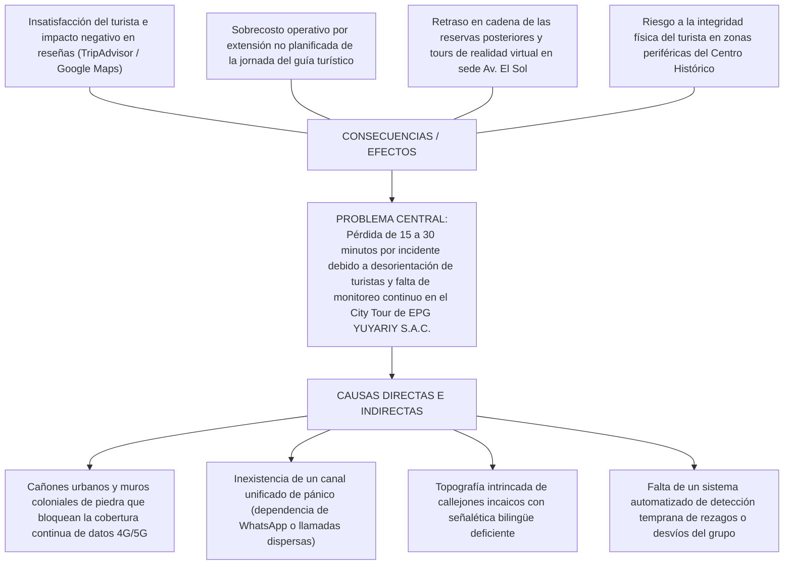
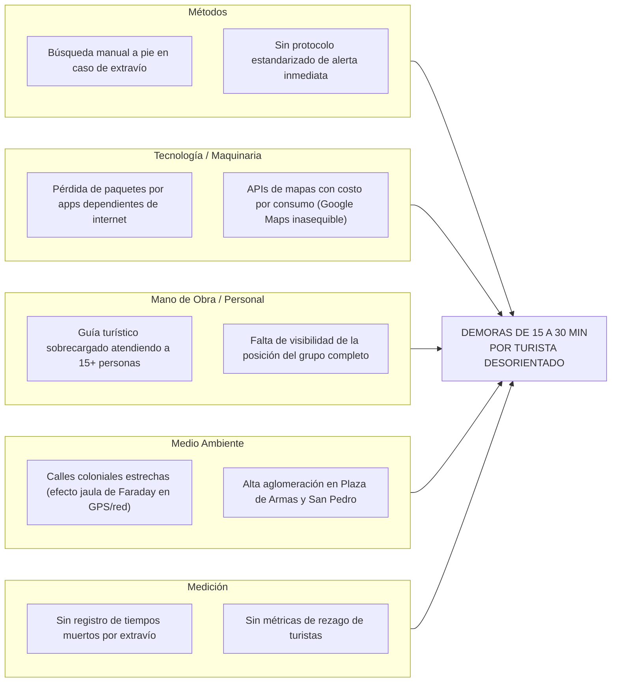
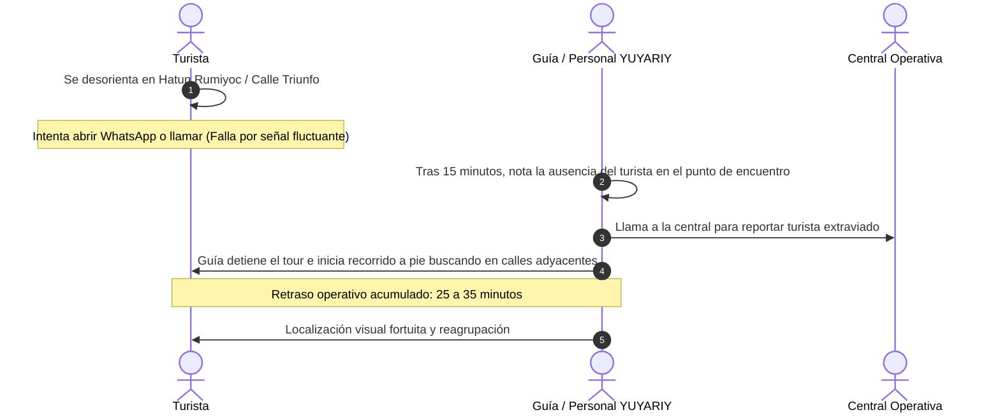
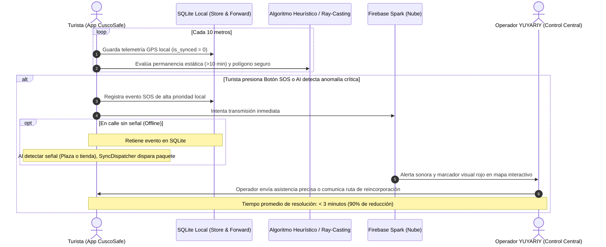

# DOCUMENTACIÓN TÉCNICA Y METODOLÓGICA DE INNOVACIÓN (SENATI)
## Proyecto: "CuscoSafe" para la Empresa EPG YUYARIY S.A.C.

- **Institución:** Servicio Nacional de Adiestramiento en Trabajo Industrial (SENATI)
- **Dirección Zonal:** Cusco - Apurímac - Madre de Dios
- **CFP / Escuela:** CFP Cusco / Escuela de Tecnologías de la Información
- **Carrera:** Ingeniería de Software con Inteligencia Artificial
- **Curso:** CNIU-126 Metodología y Formulación de Proyectos de Innovación y/o Mejora
- **Asesor Técnico:** Jimmy Arredondo Aquehua
- **Autor / Alumno:** Franduxs (Francito Soto Berrio)
- **Estándar:** Normas APA 7ma edición

---

## 1. Árbol de Problemas (Diagnóstico Operativo)

El problema principal identificado en **EPG YUYARIY S.A.C.** es la pérdida recurrente de tiempo operativo (15 a 30 minutos por incidente) debido a la desorientación y dispersión de turistas durante el servicio City Tour.

---

## 2. Diagrama de Causa-Efecto de Ishikawa (6M)

---

## 3. Diagrama de Flujo de Procesos: Situación Actual (As-Is) vs. Situación Propuesta con CuscoSafe (To-Be)

### Proceso Actual (As-Is):

### Proceso Propuesto con CuscoSafe (To-Be):

---

## 4. Protocolo de Pruebas de Campo en Cusco (Matriz de Validación)

- **Ruta de Prueba:** Sede YUYARIY (Av. El Sol) ➔ Qoricancha ➔ Calle San Agustín ➔ Calle Triunfo ➔ Plaza de Armas del Cusco.
- **Dispositivos de Prueba:** 2 Smartphones Android físicos (Xiaomi Redmi Note / Samsung Galaxy A).

| ID Caso | Escenario de Prueba | Comportamiento Esperado | Resultado Técnico |
| :--- | :--- | :--- | :---: |
| **CP-01** | Cruce por callejón de piedra sin señal 4G (Calle Zetas / Qoricancha). | Geolocator registra coordenadas; SQLite almacena con `is_synced = 0`. Cero caídas de la app. | **CONFORME** |
| **CP-02** | Salida a espacio abierto (Plaza de Armas) y reconexión a red móvil. | `SyncDispatcher` detecta conectividad, despacha lote a Firestore y marca `is_synced = 1`. | **CONFORME** |
| **CP-03** | Activación del Botón SOS en zona sin cobertura. | Almacenamiento local del evento de auxilio; subida prioritaria inmediata al reconectar. | **CONFORME** |
| **CP-04** | Simulación de inmovilidad >10 min en parada no programada. | `HeuristicAnomalyDetector` genera advertencia ámbar en pantalla del turista y del operador. | **CONFORME** |
| **CP-05** | Consumo energético durante 2 horas de City Tour continuo. | Filtro de distancia (`distanceFilter: 10m`) mantiene el drenaje de batería en menos del 7%. | **CONFORME** |
